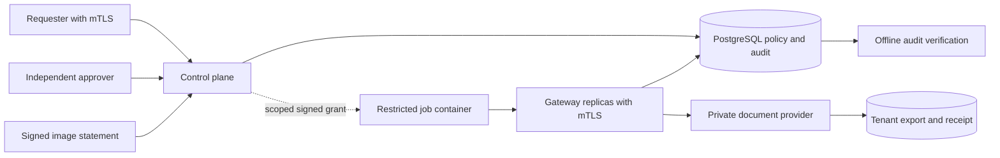

# LeaseGate

Scoped execution leases for background jobs and agent tool calls.

LeaseGate authorizes a concrete operation immediately before admitting its side effect. It binds the requester, tenant, document version, destination, job identity and approved image digest, then atomically records admission and consumes the execution budget in PostgreSQL. A separate gateway holds the provider credential; the worker never receives it.

This is a working reference implementation for a document export workflow. The provider actually writes an export snapshot and returns a receipt. It does not send documents to external services: `tenant` and `external` are policy destinations inside the reference provider.



## Security properties

| Boundary | Enforcement |
| --- | --- |
| Workload identity | TLS 1.3 with a trusted client certificate and exactly one accepted SPIFFE-format URI SAN; HTTP identity headers have no authority. |
| Operation scope | Signed grant and immutable job state must agree on requester, tenant, resource, version and destination. The job certificate must identify that exact job. |
| Approval | External exports require a different principal with the tenant's approver role. Approval binds the existing immutable job. |
| Delegation | Children inherit scope, have no later expiry and share a single execution budget across the entire ancestry tree. Depth is limited to eight jobs. |
| Revocation | Admissions and policy mutations share a transaction lock. Admissions ordered after committed revocation are denied on every replica. |
| Replay and races | Unique grant, job and delegation-root constraints plus transactional admission prevent repeated admission. |
| Audit availability | A failed admission audit write rolls back the execution claim before contacting the provider. Denial logging is best effort. |
| Credential separation | Only the gateway has the provider credential. The provider additionally requires the gateway's mTLS identity. |
| Worker restrictions | A digest-selected, nonroot container with a read-only filesystem, dropped capabilities, no new privileges, seccomp and resource limits. Its internal network has no direct provider attachment. |
| Artifact admission | A separate Ed25519 release key signs a statement binding image content digest, source commit, builder and expiry. The trusted launcher selects that exact image ID. |
| Audit integrity | Hash-linked events and signed checkpoints support offline verification against an independently retained checkpoint. |

Revocation stops later **admissions**, not an effect admitted before the revocation transaction. Provider timeouts leave an uncertain outcome and consume the execution budget. These are deliberate distributed-systems semantics, not an exactly-once delivery claim.

## Run

Requires Linux, Docker Engine with Compose, Go 1.25 or newer, Node.js 22.13 or newer, npm, OpenSSL, curl and Git. The host needs loopback ports 18440, 18441, 18442 and 55449 available. Internet access is required for initial dependency and PostgreSQL image downloads.

```sh
git clone git@github.com:4ym3nn/leasegate.git
cd leasegate
make test check
make demo
```

Run from a clean Git checkout. The demo builds a static Go binary and scratch image, creates a local CA and synthetic identities, initializes the database, signs the image statement and runs integration checks against two real gateways. A container worker performs an approved export and checks its process and network restrictions.

Generated keys, credentials, certificates and configuration stay in `.local/`, a host directory with mode `0700`. Container-mounted files are readable by the container's nonroot UID. Nothing in that directory belongs in Git. The fixture CA is valid for two days and leaf certificates for one day; this is a local demonstration, not a certificate lifecycle service.

The integration suite temporarily stops its own provider and database, restarts its gateways and changes permissions in its fixture database. Run it only against this Compose project. Existing projects are not used as test targets.

Expected checks include:

- One effect from 32 concurrent submissions across two gateways.
- Denial after ancestor or requester revocation, including after restart.
- Independent approval, tenant and workload binding, scope attenuation and expiry.
- Rollback before any effect when admission audit persistence fails.
- Provider outage handling with no automatic replay.
- Container isolation and separate database privileges.
- Authority Boundary token interoperability and an AuthzTrace revocation scenario.
- Offline rejection of edited or truncated audit exports.

Results are written to `reports/integration.json`, `reports/authztrace.json`, `reports/authztrace.xml` and `reports/authztrace.sarif`. Audit evidence is in `reports/audit.json` and `reports/checkpoint.json`. Those files contain synthetic identities and are ignored by Git.

```sh
# Verify against a checkpoint previously retained in a separate trust location.
bin/leasegate verify-audit \
  --events reports/audit.json \
  --checkpoint reports/checkpoint.json \
  --key .local/audit.pub

# Stop containers while preserving fixture state.
make clean-services
```

The demo saves the checkpoint beside the export for convenience. For independent evidence, retain a copy outside the service's write access before verifying later exports. A checkpoint obtained only from an already compromised signer provides no independent protection.

## Existing project integrations

[Authority Boundary](https://github.com/4ym3nn/authority-boundary) verifies a grant generated by Go, then signs a grant accepted by the running gateway. Interoperability covers its v2 Ed25519 wire format and the ASCII string parameter subset used here. LeaseGate supplies its own transactional policy enforcement.

[AuthzTrace](https://github.com/4ym3nn/authztrace) runs a revoke-then-execute scenario against the live control plane and gateway. A local test transport selects mTLS certificates; its actor selector never reaches the service. The scenario produces JSON, JUnit and SARIF reports.

Private package snapshots are kept under `integrations/vendor/` with SHA-256 checksums and an npm lockfile so tests do not require access to sibling repositories. They are test dependencies, not part of the Go runtime.

## Design and operational limits

Read the [architecture and API](docs/architecture.md), [threat model](docs/threat-model.md), and [operations guide](docs/operations.md).

Version 0.1 is a reference implementation, not an independently audited production platform. Identity issuance and image launch are trusted host functions. This release does not implement SPIRE attestation, microVM isolation, Sigstore verification, key rotation, an automatic uncertain-outcome reconciler, or high availability for PostgreSQL. It supports one typed provider operation; connecting an arbitrary shell or unrestricted HTTP tool would require a different threat model.

The repository is private and all rights are reserved. No permission to redistribute is granted by the current license.
