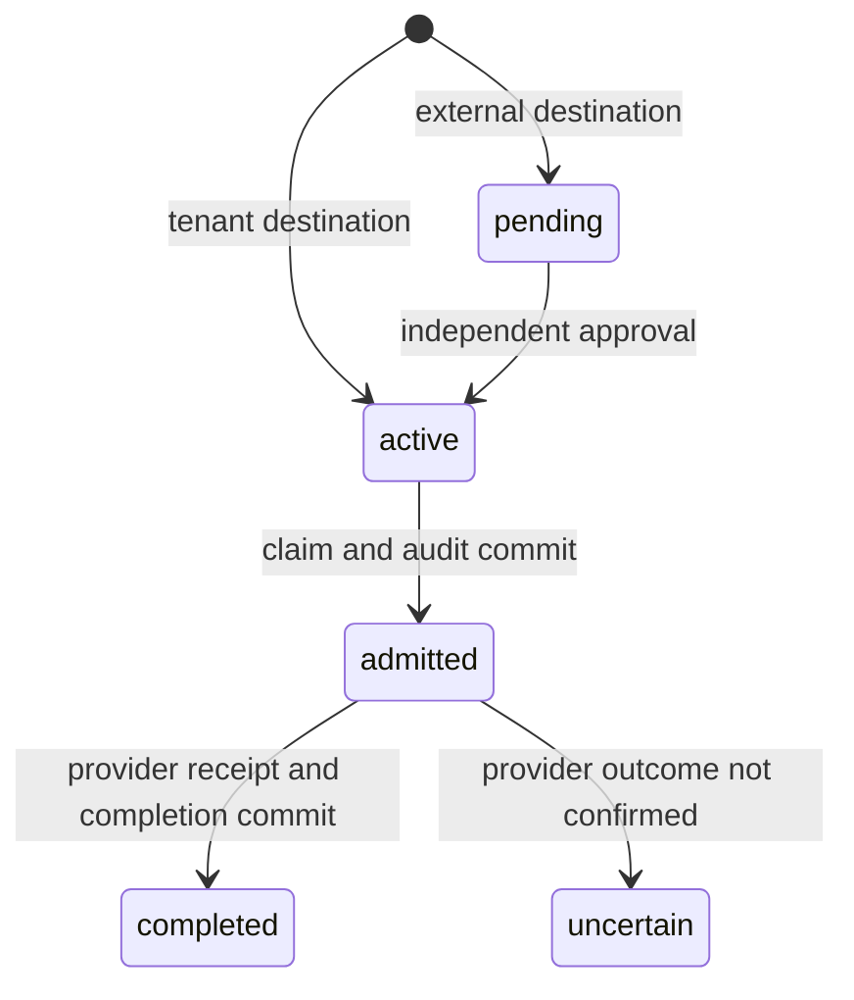

# Architecture and API

## Admission is the ordering point

All policy changes, approval changes, audit appends and admissions acquire PostgreSQL transaction advisory lock `70421001`. The lock remains held through commit. At `READ COMMITTED`, statements after acquiring it observe earlier committed revocations. It is deliberately global in version 0.1: correctness is easy to inspect, but independent tenants do not receive independent throughput.

Admission checks the certificate's job identity and tenant, signed operation bindings, live requester status, artifact expiry, every ancestor's scope and revocation state, grant expiry and execution budget. In the same transaction it inserts a claim unique by grant ID, job ID and root job ID, marks the job admitted and appends the admission event. Only after commit does the gateway contact the provider.

The provider transaction checks tenant, document ID and exact version while copying content into an export record. Job ID is its idempotency key. An existing key with a different operation hash is rejected. This ties resource state to the effect at the provider, avoiding a separate document-read / document-use window.

Revocation is an orthogonal flag, not a state transition that discards execution history. Expiry is evaluated on each admission. An ancestor's completed state does not itself revoke descendants, but the shared root claim still blocks all additional admissions. Children cannot change document, version, destination, tenant, requester or image.

## Failure semantics

| Failure | Result |
| --- | --- |
| Policy database unavailable before admission | HTTP 503; no provider call. |
| Admission audit insertion fails | Transaction rolls back; no claim and no provider call. |
| Provider times out or rejects the operation | HTTP 503, `status: uncertain`, `retry: false`; the claim stays consumed. A rejected version produces this conservative result too. |
| Provider confirms but completion cannot persist | HTTP 202, `status: completed_audit_pending`, receipt and `retry: false`. |
| Gateway crashes after admission | The job can remain `admitted`; operators must reconcile its provider record. |
| Client loses a response | Read the job and its provider evidence. Do not recreate the operation automatically. |
| Revocation commits after admission | The already admitted effect may finish. Later admissions are denied. |

The system offers at-most-once admission per delegation tree, not guaranteed execution or exactly-once delivery across arbitrary providers. A database restore can restore old claims and policy state; backup rollback is outside this guarantee.

## HTTP interface

All endpoints require a client certificate trusted by the fixture CA. JSON request bodies have a 64 KiB limit. Unknown fields, duplicate keys including case aliases, trailing JSON, oversized grants and excessive nesting are rejected. Identity comes from the verified certificate, never an HTTP header. No endpoint takes a provider URL.

Control plane: `https://localhost:18440`.

| Method and path | Caller | Body or behavior |
| --- | --- | --- |
| `POST /artifacts` | Platform operator | `{statement, signature}` from `sign-artifact`; valid release signature required. A new statement may renew the same digest. |
| `POST /jobs` | Tenant requester | `document`, `version`, `destination`, `imageDigest`, `lifetimeSeconds` from 1 to 300. |
| `GET /jobs/{id}` | Owner, tenant approver or tenant operator | Current job, admission and receipt state. |
| `POST /jobs/{id}/approve` | Independent tenant approver | Approves an existing pending job. |
| `POST /jobs/{id}/delegate` | Owner | `{lifetimeSeconds}`; creates a child under the same execution budget. |
| `POST /jobs/{id}/grant` | Owner | Returns a short-lived signed `token`. |
| `POST /jobs/{id}/revoke` | Owner or tenant operator | Revokes the job and authorization inherited by descendants. |
| `POST /principals/{name}/disable` | Same-tenant operator | Disables a user and their outstanding execution authority. |
| `GET /audit` | Platform auditor | Full event stream and signed checkpoint. |

Gateways: `https://localhost:18441` and `https://localhost:18442`.

| Method and path | Caller | Body or behavior |
| --- | --- | --- |
| `POST /execute` | Matching job certificate | `token`, `jobId`, `document`, `version`, `destination`. Success is HTTP 201 with a receipt. |
| `GET /metrics` | Enabled platform auditor | Per-process Prometheus counters for requests, denials, admissions, completions and uncertain outcomes. Also available on the control plane. |
| `GET /health` | Any accepted certificate identity | Database connectivity and server mode. Also available on the control plane. |

Error bodies have a stable `error` code without database or credential details. Validation errors use 400, unauthorized operations 403, absent resources 404, consumed budgets 409, capacity limits 429 and unavailable dependencies 503. TLS rejects a missing or untrusted certificate before HTTP dispatch.

## Key and credential separation

- The control plane holds grant and audit signing keys, plus the release verification key.
- Gateways hold the grant verification key, their service TLS key and the provider credential.
- The provider holds its TLS key and the expected provider credential.
- A worker receives only its certificate and key, CA certificate and one operation grant.
- CA and release signing keys remain on the trusted fixture host.

Runtime database credentials cannot update or delete audit rows and cannot read provider documents. Provider credentials cannot read policy tables. Database owners and trusted services remain inside the trust boundary; these grants do not make a compromised gateway harmless.

The control plane and gateways expose loopback ports using a management network. The backend and worker networks are internal Docker networks. Only the gateways attach to the worker network. IPv4 forwarding is disabled in gateway namespaces. Workers share that network in this version, so this is not per-job network isolation.
